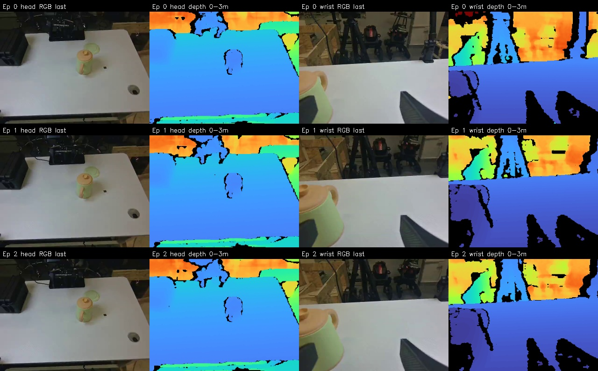
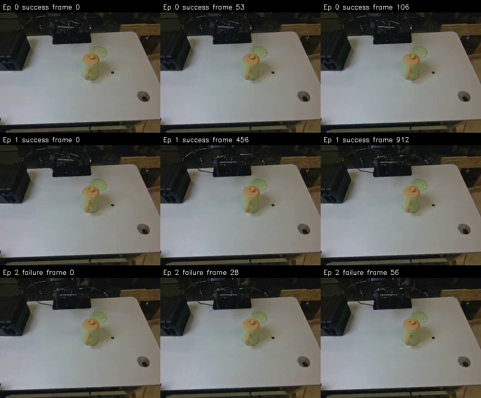

# demo_200 数据与深度检查

检查对象：`datas/demo_200`

## 结论

- 数据结构和文件完整性通过：Parquet、两路 RGB 视频、两路深度图和 episode 边界一致，没有发现缺帧、损坏文件、整帧零深度、连续重复深度帧或 65535 饱和值。
- `head` 第三视角深度效果较好，全部 1077 帧的平均有效像素比例为 96.30%，最低为 93.06%。空洞主要位于物体轮廓、遮挡边界和远处背景。
- `wrist` 腕部深度效果一般，平均有效像素比例为 77.94%，最低为 65.22%。画面有明显的大块零深度区域，训练或预处理时需要使用 `depth > 0` 掩码。
- 当前数据没有开启 HoleFilling。三个 episode 的 `cameras.json` 中，`head` 和 `wrist` 均记录为 `"hole_filling_mode": null`。
- Episode 0 和 2 基本没有动作；Episode 0 却标记为 `success`。Episode 1 有明显关节运动，但从首帧、中间帧和末帧抽样看，水壶与绿盘的位置变化不明显，建议回看完整 RGB 视频确认任务是否真的完成。

## 数据概况

| 项目 | 结果 |
| --- | ---: |
| Episode 数 | 3 |
| 总帧数 | 1077 |
| 总时长 | 35.90 s |
| 采样率 | 30 FPS |
| Episode 0 | 107 帧，3.57 s，`success` |
| Episode 1 | 913 帧，30.43 s，`success` |
| Episode 2 | 57 帧，1.90 s，`failure` |

两路 RGB 视频均为 640×480、30 FPS、1077 帧，完整解码且没有损坏帧。两路深度均为 640×480 的 `uint16` PNG，每路 1077 张；深度单位为 1 mm，并已通过软件对齐到彩色图。

## 深度质量

| 相机 | 平均有效像素 | 最低有效像素 | 平均空洞 | 整帧全零 | 重复帧 | 饱和值 |
| --- | ---: | ---: | ---: | ---: | ---: | ---: |
| `head` | 96.30% | 93.06% | 3.70% | 0 | 0 | 0 |
| `wrist` | 77.94% | 65.22% | 22.06% | 0 | 0 | 0 |



第三视角对桌面、水壶和绿盘的结构表达较清楚，现有空洞主要沿物体边缘分布。腕部视角下，桌面近距离区域尚可使用，但机械臂、反光或低纹理区域以及视野边缘存在大片黑色无效区域。

## 时间同步

| 项目 | 平均 | 最大 |
| --- | ---: | ---: |
| `head` RGB/深度设备时间戳差 | 0.158 ms | 1 ms |
| `wrist` RGB/深度设备时间戳差 | 0.175 ms | 2 ms |
| 两相机主机到帧时刻差 | 6.86 ms | 30.09 ms |

每路深度都有 3 次约 67 ms 的设备帧间隔，相当于偶发跳过约一帧；落盘后的 RGB、深度、帧号和 episode 配对仍然完整。两台相机之间没有硬件同步，因此不适合假设它们在亚毫秒级同时曝光。

## HoleFilling 配置

当前数据不是开启 HoleFilling 后采集的数据。代码现在会在 `depth.cameras` 包含 `head` 时默认以
`FURTHEST` 模式开启。也可以在命令中显式写出：

```bash
--depth.hole_filling_cameras='[head]' \
--depth.hole_filling_mode=FURTHEST
```

HoleFilling 会显著减少零值，但填补区域是推断值，尤其在物体轮廓附近可能把背景深度扩展到前景。建议保留原始零值掩码，或至少在正式批量采集前检查水壶和机械臂边缘是否出现错误扩张。

## 示教内容复核



文件完整不代表示教标签正确。Episode 0 只有 3.57 秒且关节动作基本静止，却标记为 `success`；Episode 2 只有 1.90 秒且基本静止，标记为 `failure`。正式训练前建议删除无有效动作的 episode，或重新确认成功/失败标签。
