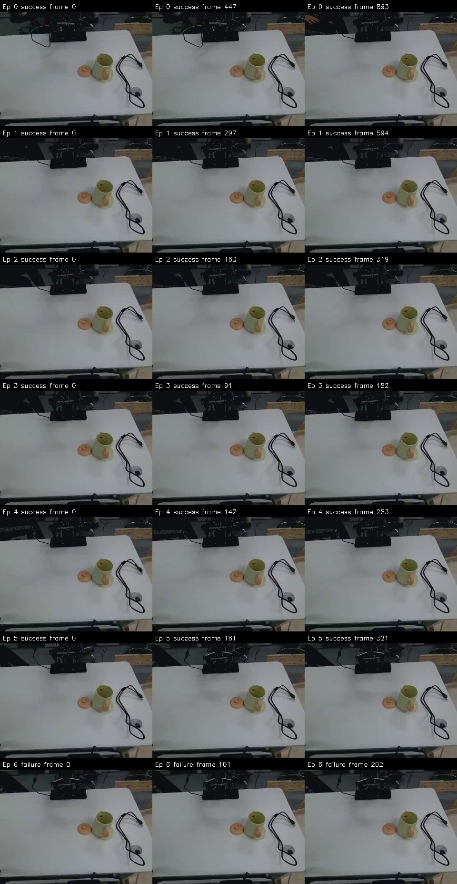
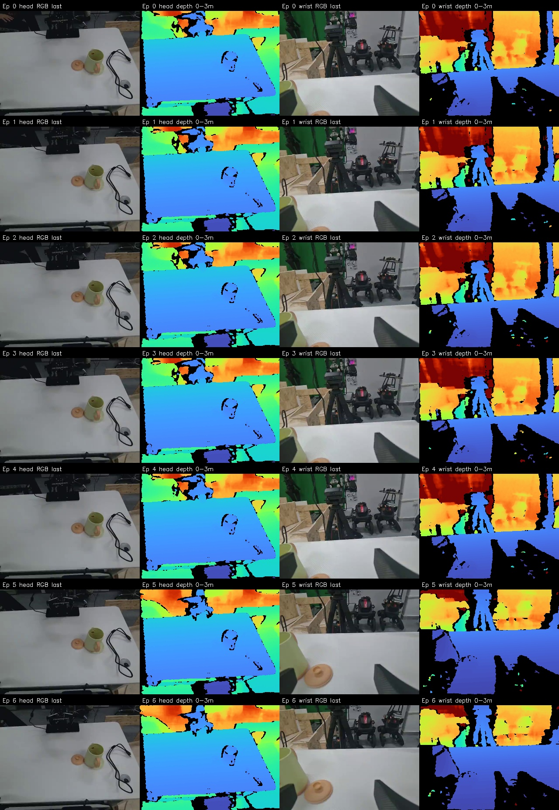

# demo_init_003 数据检查

检查对象：当前 `datas/demo_init_003` 中的 7 个 episode、2801 帧，30 FPS。
该版本与此前报错后只提交 1 段的版本不同。本次只读取原始数据，未修改数据或采集代码；
检查前后文件数量、大小和修改时间一致。

## 结论

文件保存完整性检查通过：动作/状态、episode 元数据、两路 RGB 视频和深度图的帧数及编号一致。
没有发现此前视频拼接失败造成的未提交段、孤立数据行或失败暂存目录。
LeRobotDataset 使用 `video_backend="pyav"` 加载成功；每段首帧、中间帧和末帧共 21 个位置
的两路 RGB 均可正常读取。

深度数据完整，但腕部视角约 31.19% 像素属于缺测或极值候选区域，需要过滤。
这批数据可以用于验证 RGB-D 采集和加载流程；若用于任务训练，应先复核实际示教内容与成功标签。

## Episode 清单

| Episode | 帧数 | 时长（秒，帧数 / 30） | 保存的标签 |
| --- | ---: | ---: | --- |
| 0 | 894 | 29.80 | success |
| 1 | 595 | 19.83 | success |
| 2 | 320 | 10.67 | success |
| 3 | 183 | 6.10 | success |
| 4 | 284 | 9.47 | success |
| 5 | 322 | 10.73 | success |
| 6 | 203 | 6.77 | failure |

总计 93.37 秒，6 段 success、1 段 failure。标签是采集程序记录的结果，不代表已经自动验证任务成功。
采集来源字段均为 `human`。

## 文件完整性

| 检查项 | head 第三视角 | wrist 腕部 |
| --- | --- | --- |
| 相机序列号 | CP9KB5300030 | CP9KB5300059 |
| 完整解码的 RGB 帧数 | 2801 | 2801 |
| 实际读取的深度 PNG | 2801 | 2801 |
| 深度尺寸、类型 | 480×640，uint16 | 480×640，uint16 |
| 原始深度单位 | 1 mm | 1 mm |
| 深度 PNG 缺失、不可读、尺寸或类型错误 | 0 | 0 |
| 整张深度为零 | 0 | 0 |
| 段内连续完全相同的深度图 | 0 | 0 |
| RGB 损坏帧 | 0 | 0 |
| RGB 拼接后帧时间与 frame_index / 30 的最大误差 | 0 s | 0 s |

逐张读取了全部 5602 张深度图，完整解码了两路视频的全部 5602 帧。

- `meta/info.json`、episode 元数据长度之和和 Parquet 实际行数均为 2801。
- 7 段的全局索引、段内索引、数据范围、深度清单和视频时间范围一致。
- 各段深度 `frames.jsonl` 的帧号、时间戳与 Parquet 对应；路径、RGB 字段和序列号与标定文件对应。
- 数值字段没有 NaN/Inf，各列没有空值；动作和状态有变化，并非全零。
- 没有 `failed_episode_*`、`.pending_*` 目录或额外临时 MP4。

## 深度质量与时间关系

以下“可用候选像素”定义为 `0 < raw_depth < 65535`，不代表测距精度已经经过标定验证。

| 指标 | head | wrist |
| --- | ---: | ---: |
| 可用候选像素比例，平均 | 90.27% | 68.81% |
| 可用候选像素比例，逐帧最低 | 88.52% | 66.26% |
| 零值像素比例，平均 | 9.73% | 31.13% |
| 65535 像素总数 | 0 | 502428 |
| 65535 像素比例 | 0% | 0.0584% |
| 同一相机 RGB/深度设备时间戳差，最大 | 1 ms | 3 ms |
| 段内深度设备时间戳间隔，最大 | 67 ms | 67 ms |
| 段内超过 50 ms 的设备时间戳间隔次数 | 3 | 3 |

时间戳没有倒退或重复。各相机有 3 次约 66–67 ms 的间隔，相当于采集时跳过约一帧；
落盘帧号和 RGB-D 文件配对没有缺号。间隔位置如下，帧号指间隔之后的帧：

- head：episode 0/frame 485，episode 1/frame 105，episode 2/frame 80。
- wrist：episode 0/frame 324、759，episode 3/frame 50。

双相机主机到帧时刻之差平均 10.94 ms，最大 30.41 ms。
这不是曝光时间差测量，两台相机没有硬件同步，不能仅凭相同 frame_index 认定严格同时曝光。

深度为传感器原生坐标，所有清单均为 `aligned_to_color=false`。
即使 RGB 和深度尺寸相同，也不能直接逐像素叠加；做融合时需要相应的对齐或标定。
原始值 0 是缺测，65535 作为极值候选过滤，并结合任务实际距离设置有效范围。
本次没有用已知距离标定板检查绝对测距误差。

## 示教内容需要复核

任务文本是 `Put the kettle on the green plate.`。
检查了每段首、中、末帧，并额外按约 3 秒间隔抽查第三视角画面：
桌面上的壶/杯状物体位置在多数抽查帧中基本不变，没有清楚展示完整的放置任务过程。
腕部末帧中较大区域拍到远处背景，目标物体部分处于画面边缘。

抽查不能排除两次采样之间发生过动作，也不能仅凭画面断言标签错误；
但如果这批是正式任务示教，应回看完整视频，确认实际完成了目标任务、目标与夹爪可见，
并核实 success/failure 标签。若只是测试按键、机械臂或保存流程，应按测试数据使用。

采集时应先按 `s` 结束成功示教，再在 `Reset the environment` 阶段复位，避免把复位动作混入示教。
Episode 6 被保存为 failure；若训练只使用成功示教，需要按标签筛选。

深度目前以 PNG 和 JSON 清单作为附加文件保存，默认 LeRobot 训练加载器不会自动将它作为输入。

## 预览

每段首、中、末帧：

各段末帧 RGB/深度：深度用 0–3 m 伪彩色显示，黑色为 0 或 65535；仅用于检查，原始 PNG 未修改。

